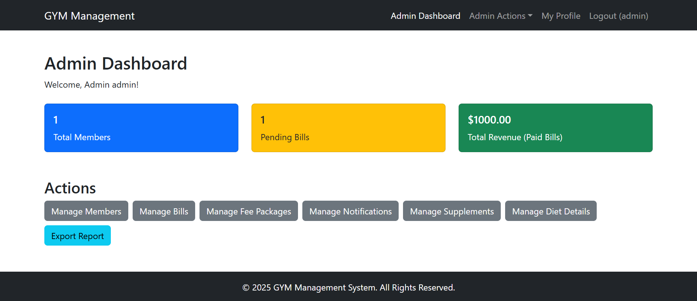
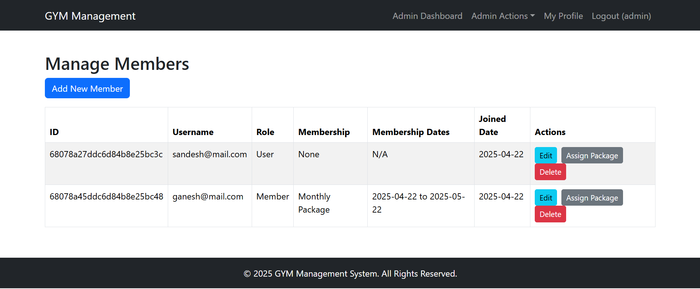
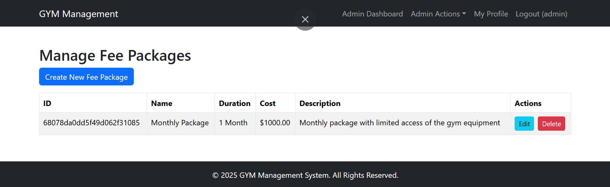
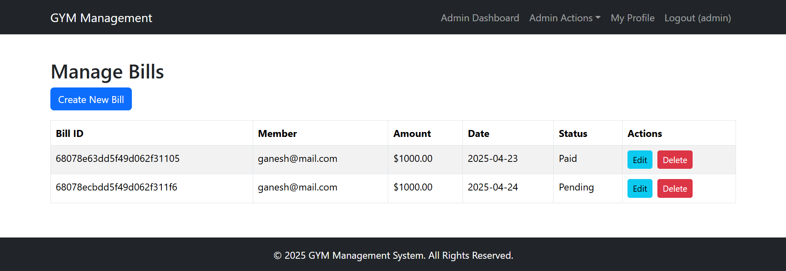
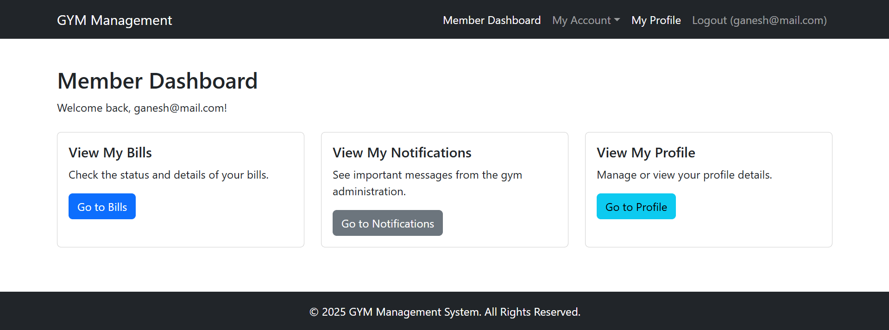
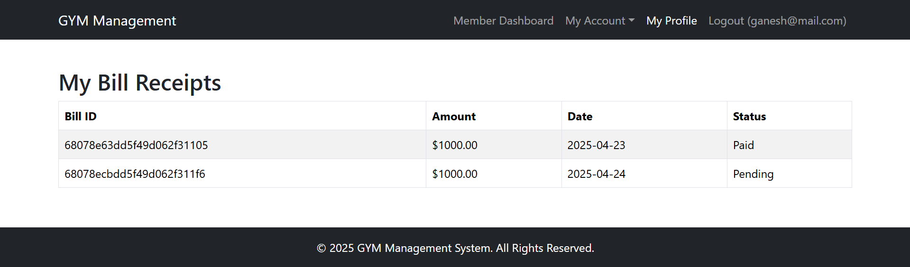
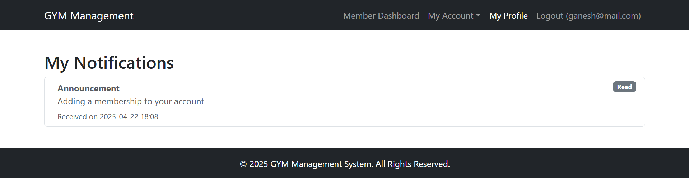
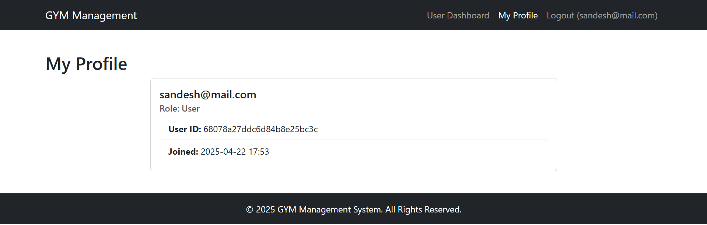

# GYM Management System

A web application built with the MERN stack (MongoDB, Express.js, React, Node.js) for managing gym operations, including members, billing, fee packages, notifications, supplements, and diet details. It provides role-based access for Admin, Member, and general Users.

## ✨ Features

- **User Authentication:** Secure registration and login system using JWT and bcrypt.
- **Role-Based Access Control:** Differentiated access for Admin, Member, and User roles via protected routes and backend middleware.
- **Admin Dashboard:** Overview of key statistics (Members, Pending Bills, Revenue - placeholder).
- **Admin Management Modules:**
  - **Manage Members:** Create, view, update, and delete member accounts.
  - **Manage Bills:** Create, view, update, and delete bill records and link them to members.
  - **Manage Fee Packages:** Create, view, update, and delete different membership packages.
  - **Manage Notifications:** Create and assign notifications to members.
  - **Manage Supplements:** Manage supplement inventory (placeholder CRUD).
  - **Manage Diet Details:** Manage diet plans or advice details (placeholder CRUD).
- **Membership Assignment:** Admin can assign specific fee packages with start dates to members from the Manage Members section.
- **Member Views:** Logged-in Members can view:
  - Their personal dashboard.
  - Their assigned bills.
  - Notifications assigned to them.
- **General User Views:** Logged-in Users (including Members and Admins) can view:
  - Their profile details.
  - A general user dashboard (can be adapted based on role).
- **Secure API Endpoints:** Backend APIs are protected using JWT authentication and role-based authorization middleware.

## 📸 Screenshots

- **Login Page:**
  

- **Sign Up Page:**
  

- **Admin Dashboard:**
  

- **Manage Members (Admin):**
  

- **Assign Package Modal (Admin):**
  

- **Manage Bills (Admin):**
  

- **Member Dashboard:**
  

- **Member Bills Page:**
  

- **Member Notifications Page:**
  

- **User Profile Page:**
  

## 🛠️ Technologies Used

**Backend (Express.js, Node.js)**

- **Node.js & Express.js:** Server runtime and web application framework.
- **MongoDB & Mongoose:** Database and ODM for data persistence.
- **JWT (jsonwebtoken):** Token-based authentication.
- **bcryptjs:** Password hashing.
- **CORS:** Enabling Cross-Origin Resource Sharing for frontend communication.
- **dotenv:** Loading environment variables from a `.env` file.
- **Moment.js:** Handling date and time (especially for membership duration calculation).
- **Error Handling Middleware:** Custom middleware for centralized error handling.

**Frontend (Vite + React)**

- **React:** Component-based UI library.
- **Vite:** Fast build tool for modern web projects.
- **React Router DOM:** Client-side routing.
- **Axios:** Promise-based HTTP client for API calls.
- **Bootstrap & React-Bootstrap:** Responsive UI components based on Bootstrap.
- **React-Router-Bootstrap:** Integration components for React Router and React-Bootstrap.
- **Moment.js:** Handling date and time display/formatting.
- **React Context API:** For managing global state like authentication (`AuthContext`).

## 📁 Project Structure

```
gym-management-system/
│
├── README.md           # Project overview and setup instructions
├── .gitignore          # Specifies untracked files to ignore
│
├── server/             # Node.js & Express backend
│   ├── .env            # Environment variables (ignored by Git)
│   ├── package.json    # Backend dependencies and scripts
│   ├── server.js       # Main server file
│   ├── config/         # Database connection setup
│   │   └── db.js
│   ├── controllers/    # Route handlers (admin, auth, member)
│   │   ├── adminController.js
│   │   ├── authController.js
│   │   └── memberController.js
│   ├── middleware/     # Custom Express middleware
│   │   ├── authMiddleware.js # protect, admin
│   │   └── errorMiddleware.js # notFound, errorHandler
│   ├── models/         # Mongoose schemas
│   │   ├── User.js
│   │   ├── Bill.js
│   │   ├── FeePackage.js
│   │   ├── Notification.js
│   │   ├── Supplement.js
│   │   └── DietDetail.js
│   ├── routes/         # API routes
│   │   ├── adminRoutes.js
│   │   ├── authRoutes.js
│   │   ├── billRoutes.js
│   │   ├── dietDetailRoutes.js
│   │   ├── feePackageRoutes.js
│   │   ├── memberRoutes.js
│   │   ├── notificationRoutes.js
│   │   ├── supplementRoutes.js
│   │   └── userRoutes.js
│   └── scripts/        # Utility scripts (e.g., create admin user)
│       └── createAdmin.js
│
└── client/             # React frontend (Vite)
├── .env            # Frontend environment variables (Vite adds VITE_ prefix)
├── package.json    # Frontend dependencies and scripts
├── vite.config.js  # Vite configuration
├── index.html      # HTML entry point
├── src/            # Source code
│   ├── main.jsx        # App entry point
│   ├── App.jsx         # Main App component and routing
│   ├── index.css       # Global styles
│   ├── assets/         # Static assets (optional)
│   ├── components/     # Reusable UI components
│   │   ├── Auth/         # ProtectedRoute
│   │   ├── Common/       # Button, Input
│   │   └── Layout/       # Navbar, Footer
│   ├── context/        # React Context providers (AuthContext)
│   ├── pages/          # Page components for different routes
│   │   ├── Admin/        # Admin management pages
│   │   ├── Auth/         # SignIn, SignUp
│   │   ├── Members/      # Member-specific pages
│   │   ├── User/         # General User pages
│   │   ├── HomePage.jsx  # Public Home Page
│   │   └── NotFoundPage.jsx # 404 Page
│   └── utils/          # Utility functions (api.js)
└── public/             # Static files copied to build (optional)
```

## 🚀 Getting Started

### Prerequisites

- **Node.js** (v14 or later) & **npm** (v6 or later)
- **MongoDB** instance (local or cloud like Atlas)
- **Git**

### 1. Clone the Repository

```bash
# Replace with your actual repository URL
git clone <your_repo_url> gym-management-system
cd gym-management-system
```

### 2. Backend Setup

Navigate to the server directory:

```bash
cd server
npm install
```

Create a .env file in the server/ directory and add your environment variables:

```bash
# server/.env
NODE_ENV=development
PORT=5000 # Or any desired port
MONGO_URI=<your_mongodb_connection_string> # e.g., mongodb://localhost:27017/gymdb
JWT_SECRET=<your_strong_random_secret_key> # Use a long, random string
JWT_EXPIRE=30d # Token expiration time (e.g., 30 days)
```

Navigate to the server directory and run the script:

```bash
node ./scripts/createAdmin.js
```

This script will create an admin user with default credentials (e.g., username: admin, password: 123456 - check the script for exact values) if one doesn't already exist. You can then use these credentials to log in as an admin from the frontend.

### 3. Frontend Setup

Navigate to the client directory:

```bash
cd ../client
```

Install frontend dependencies:

```bash
npm install
Create a .env file in the client/ directory and add your frontend environment variable:
```

Code snippet

```bash
# client/.env
VITE_REACT_APP_API_URL=http://localhost:5000 # Or the URL of your backend API
```

### 4. Run the Project

Start Backend
Open a terminal, navigate to the server directory, and start the backend server:

```bash

cd server
# If you have nodemon configured in package.json:
# npm start
# Or if using node directly:
node server.js
```

The backend should log "MongoDB Connected..." and "Server running on port...".

Start Frontend
Open a new terminal, navigate to the client directory, and start the frontend development server:

```bash
cd client
npm run dev
```

Open your browser and navigate to the URL displayed by Vite (e.g., http://localhost:5173).

## ▶️ Usage

Ensure both backend and frontend servers are running.
Navigate to http://localhost:5173.
Use the Sign In page (/signin) with the admin credentials created by the script (admin / 123456 or your chosen password) or sign up as a new general user/member (/signup).
Explore the different dashboards and management pages based on the logged-in user's role. Admins can manage entities and assign memberships from the "Manage Members" page.

## 🌱 Potential Future Enhancements

- Implement Payment Gateway Integration for online fee payments.
- Add Attendance Tracking (e.g., via barcode or manual entry).
- Develop Class Scheduling functionality.
- Enhance Member Profiles with more detailed information (contact, health stats, membership history).
- Build more comprehensive Admin Dashboards with charts, graphs, and detailed reports.
- Implement notification delivery via email or SMS.
- Allow Users/Members to view and potentially purchase packages and supplements directly from the frontend.
- Add features for trainers/staff roles.
- Implement document upload/management relevant to gym (waivers, health forms).
- Improve UI/UX with better form validation, loading states, and error handling messages.
- Add unit and integration tests for both frontend and backend.
- Set up CI/CD pipelines for automated testing and deployment.
